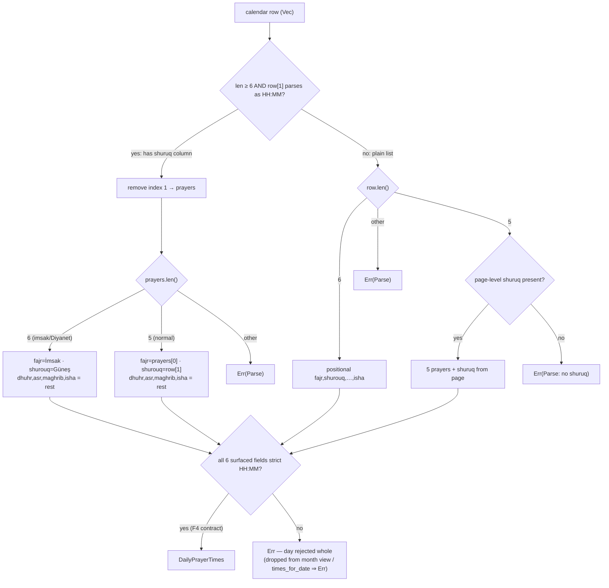
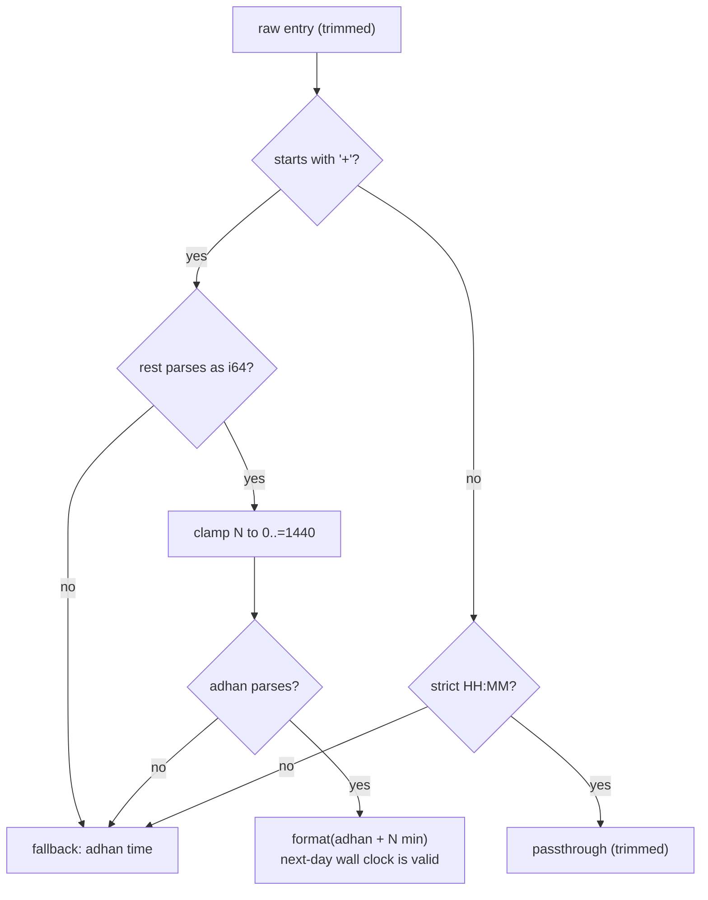
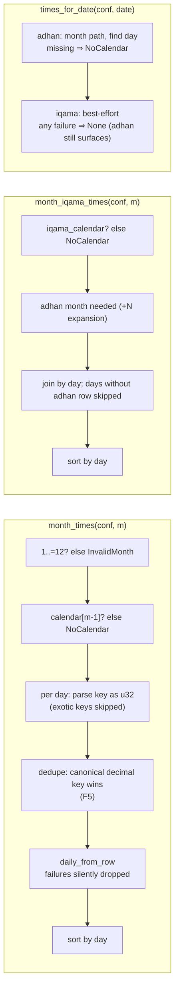

# Calendar resolution

Row-shape decision tree and iqama resolution. Normative text:
[`../specs/calendar-resolution.md`](../specs/calendar-resolution.md);
contract: [ADR-0010](../adr/0010-display-time-contract.md).

## Row-shape decision tree (`build_daily_times`)

`imsak_mode` (the `ConfData` flag) is **not** decided here — it is
`times.len() == 6`, decided once at the scraper.

## Iqama resolution (`resolve_iqama`)

Hostile-value outcomes (all pinned by tests): `+9223372036854775807` ⇒
clamped +1440 ⇒ next-day wall clock; `+abc`, `+`, garbage ⇒ adhan;
`"7:5"`, `"25:70"` (parses but not displayable) ⇒ adhan — passthrough
cannot smuggle non-display times.

## Month/date extraction

Duplicate day keys (`"1"`, `"01"`, `"+1"`) are deduplicated in step M3
(finding **F5**, fixed): one entry per parsed day, the canonical decimal
key always winning over its variants — pinned by
`finding_f5_duplicate_day_keys_yield_one_day`.
