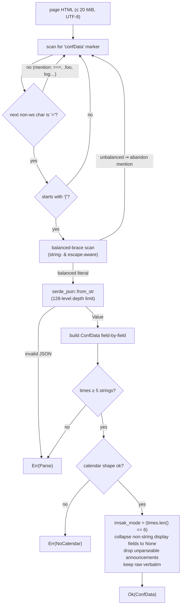

# confData parsing pipeline

From raw page bytes to a typed `ConfData`. Normative text:
[`../specs/confdata-wire-format.md`](../specs/confdata-wire-format.md);
decision: [ADR-0002](../adr/0002-one-page-one-year.md).

## Pipeline

Notes:

- Mentions are skipped, not fatal — a page can discuss `confData` in code
  and still parse.
- The **first** mention that yields a balanced literal wins.
- The only two hard errors out of the scraper are `ConfDataNotFound` and
  `Parse`; a bad `calendar` surfaces as `NoCalendar`.

## Brace-scanner state machine

```mermaid
stateDiagram-v2
    [*] --> Outside
    Outside --> Outside : other byte
    Outside --> Depth1 : {
    Depth1 --> Deeper : {
    Deeper --> Deeper : {
    Deeper --> LessDeep : }
    LessDeep --> Deeper : {
    LessDeep --> LessDeep : }
    LessDeep --> Done : } at depth 1 ⇒ return literal
    Outside --> InString : "
    InString --> InString : printable / { } ; \n
    InString --> Escape : backslash
    Escape --> InString : any byte (consumed)
    InString --> Outside : " (string closed)
    note right of InString : braces/semicolons inside strings are content —<br/>the lookalike corpus pins this
```

Depth accounting is suspended inside strings and after `\`; the literal
ends at the `}` returning depth to zero. No closing brace ⇒ `None` ⇒ the
mention is abandoned (bounded work, no backtracking).
