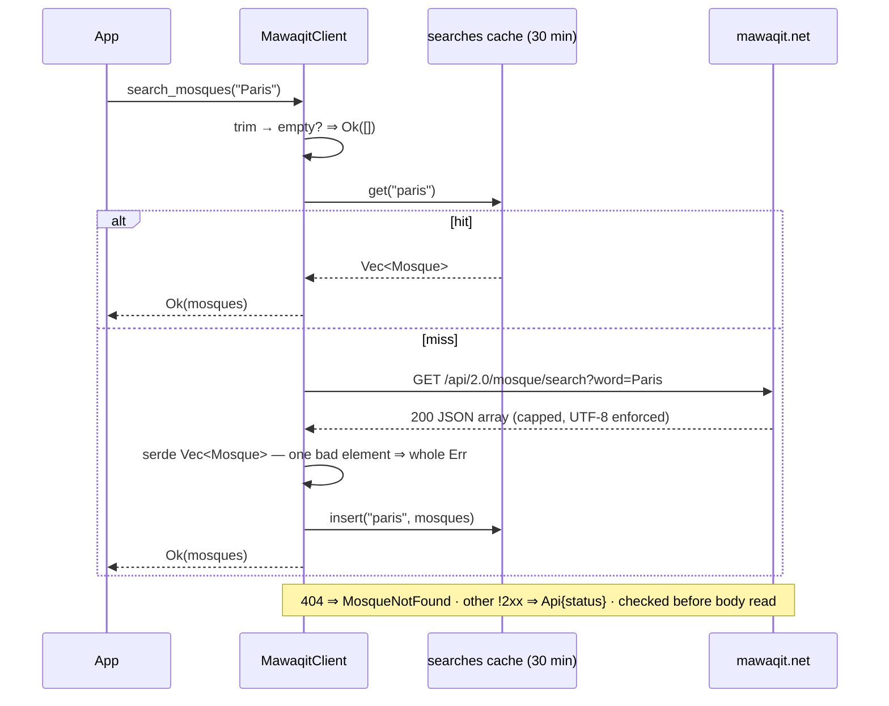
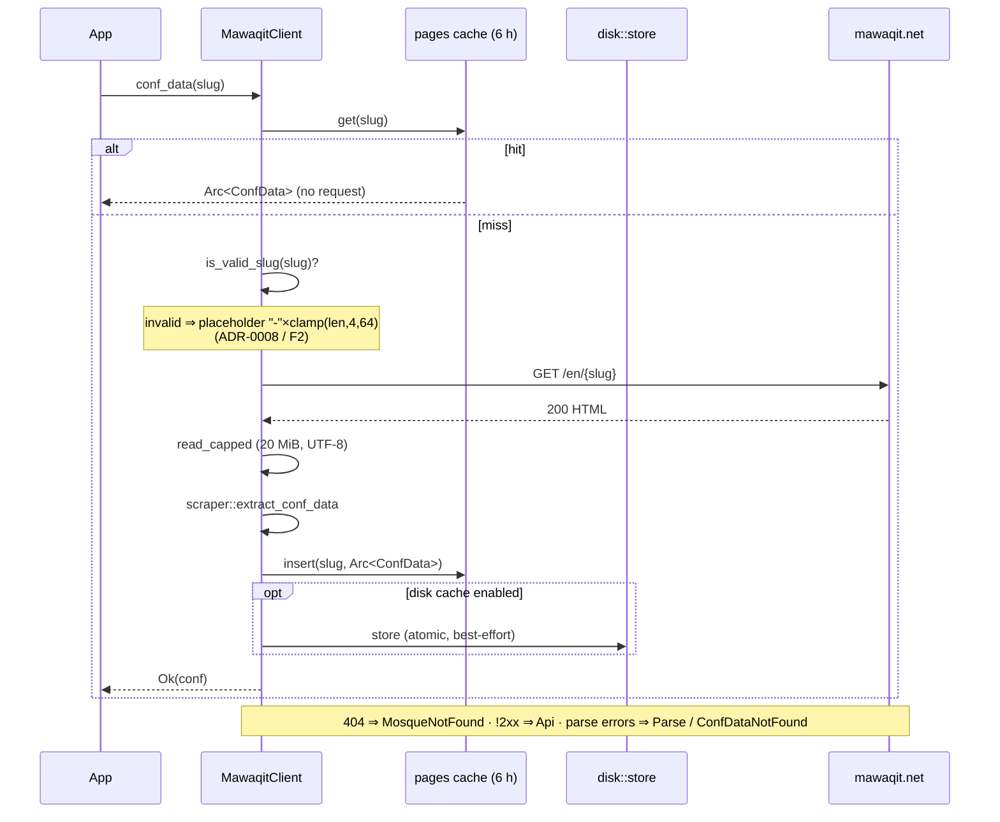
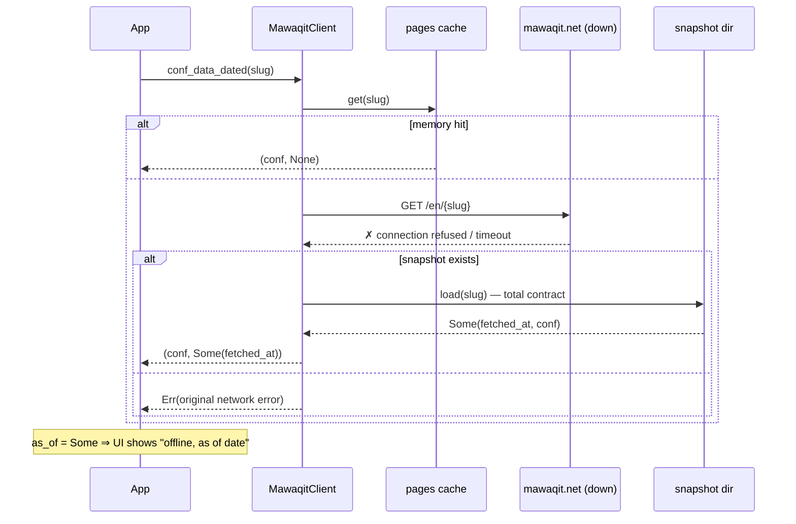

# Request flows

The three sequences an embedder triggers. Normative text:
[`../specs/transport-and-caching.md`](../specs/transport-and-caching.md).

## 1. Mosque search

## 2. confData fetch (online)

## 3. Offline fallback (`conf_data_dated`)

Key asymmetry: a **successful** fetch stores best-effort and reports
`None`; a **failed** fetch reports `Some(date)` — the date is the
"how stale is this" signal, never silently enforced as a TTL
([`../specs/offline-snapshots.md`](../specs/offline-snapshots.md)).
