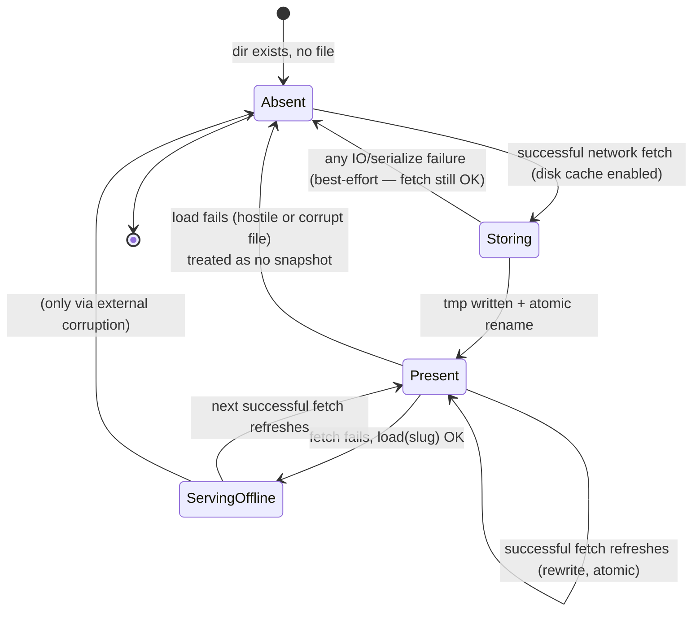
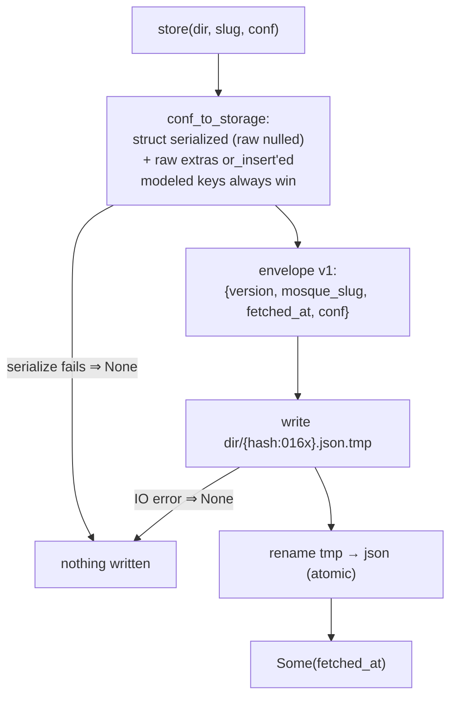
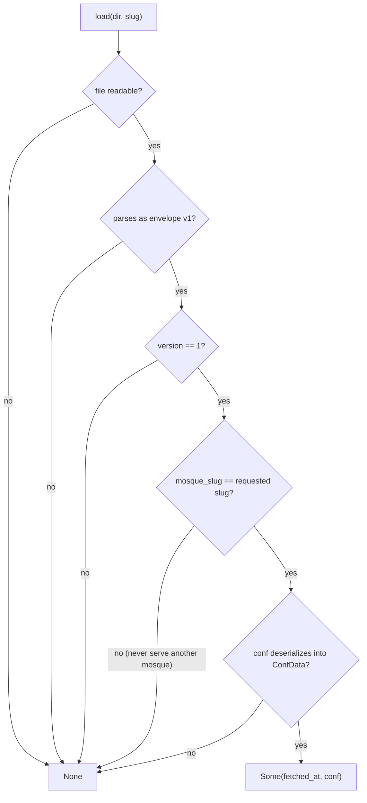
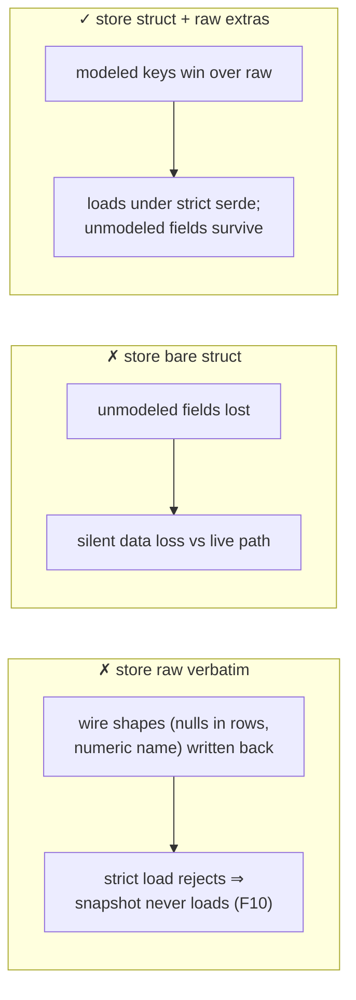

# Snapshot lifecycle

States of one mosque's offline snapshot and the flows between them.
Normative text: [`../specs/offline-snapshots.md`](../specs/offline-snapshots.md);
decision: [ADR-0005](../adr/0005-disk-snapshot-layer.md).

## State machine

Every arrow into `Absent` from a *load* is the total-load contract: a
hostile file cannot crash or poison — it is just gone.

## Store flow

## Load flow (total function)

## Why the storage value is neither raw nor bare struct

Regression anchors: `src/disk.rs::messy_wire_shapes_in_raw_never_break_loading`,
`roundtrip_survives_a_populated_raw_object`,
`tst/fuzz/mutation.rs::finding_f10_snapshot_roundtrips_wire_tolerated_shapes`.
