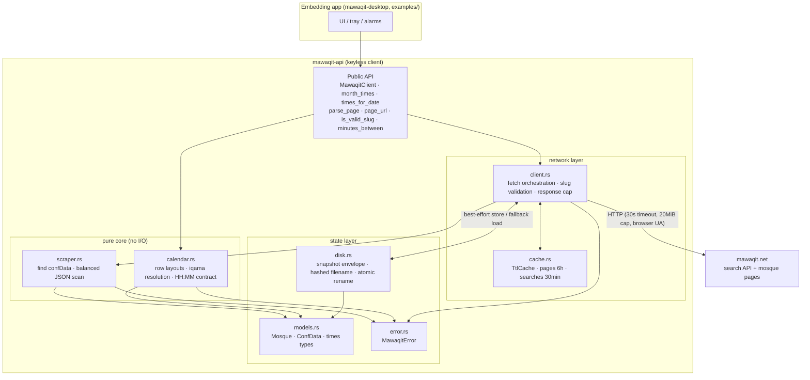

# System architecture

One crate, seven modules, three data stores. Everything above `models` is
tainted by the network; everything below the scraper/calendar boundary
promises typed, validated data.

Reading guide:

- **`client.rs`** owns all I/O decisions: which URL, which limits, cache
  consult, snapshot fallback ([`request-flow.md`](request-flow.md)).
- **`scraper.rs` + `calendar.rs` are pure** — that is what makes the whole
  hostile pyramid (ut tier, fuzz targets) able to attack the exact
  production path without sockets.
- **`disk.rs`** is the only filesystem writer, and only when the embedder
  opts in with `with_disk_cache`.
- **`models.rs`** is the shared currency: scraper produces it, calendar
  consumes/produces it, disk round-trips it, the embedder sees it.
