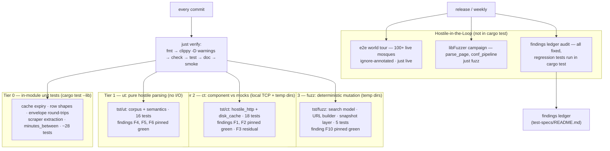

# Test pyramid

Tiers, what they gate, and where the red-team findings live. Normative
text: [`../test-specs/README.md`](../test-specs/README.md);
decision: [ADR-0007](../adr/0007-four-tier-test-pyramid.md).

## What each tier guarantees

| Tier | Guarantee nobody above it re-checks |
| --- | --- |
| 0 | internals behave (private access: cache eviction, envelope round-trip) |
| 1 | hostile bytes/JSON cannot panic, hang, or lie through the parse+calendar path |
| 2 | the client survives a lying *server* and the snapshot layer honors its store/fallback contract |
| 3 | mutation space beyond the corpus is safe, reproducibly, in CI |
| HIL | the real site's real data parses everywhere; fuzzer-class bugs stay found |

## Rule of thumb for new tests

- Pure input → behavior: tier 1 (`tst/ut`).
- Needs a socket/file but not the real site: tier 2 (`tst/ct`).
- New *surface* (public function over attacker-shaped data): seed into
  tier 3 (`tst/fuzz`) and add a corpus case.
- Real-site claim ("all mosques parse"): tier 4 fixture entry, not a unit
  test.
- Security behavior that does not hold yet: `#[ignore]`d finding test
  ([ADR-0006](../adr/0006-red-team-findings-workflow.md)).
