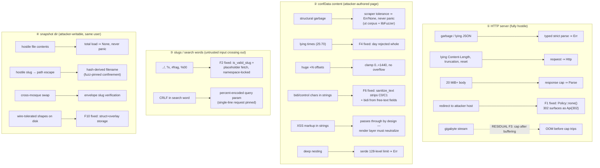

# Threat model

What can attack this library, what stops it, and where the gaps are.
Findings workflow: [ADR-0006](../adr/0006-red-team-findings-workflow.md);
transport decisions: [ADR-0009](../adr/0009-bounded-transport.md).

## Position

The client fetches *public religious data* from a server it does not
control, using identifiers (slugs, search words) that cross the boundary
in both directions, and it persists that data to disk. There are no
credentials to steal — the assets are **integrity of displayed times**
(nobody should be able to fake prayer times), **availability** (no hang,
no OOM, no crash), and **clean degradation** (hostile input ⇒ error, not
garbage on screen).

## Surfaces → defenses

Solid arrows: enforced today, pinned by tests. Dashed arrows: known gaps,
tracked as findings (currently one: F3).

## Findings on this map

| Finding | Surface | State | One-line fix |
| --- | --- | --- | --- |
| F1 | ① | Fixed | — (regression-pinned: `Policy::none()`) |
| F3 | ① | Documented residual | stream body, abort past cap |
| F6 | ② | Fixed | — (`sanitize_text`) |
| F2 | ③ | Fixed | — |
| F4 | ② | Fixed | — |
| F5 | ② (day keys) | Fixed | — (canonical key wins) |
| F10 | ④ | Fixed | — |

## Explicit non-goals

- **Content sanitation for rendering**: the parser cannot know the render
  context; XSS-neutralization belongs to the frontend (the contract is
  "never panic, never mis-shape" — pinned by
  `conf_page_hostile_xss_content_parses_structurally`).
- **TLS-level MITM**: rustls validates the host; a hostile *CA* is out of
  scope (standard library-level trust).
- **Local malware with the user's privileges**: it can do anything the app
  can; the snapshot rules only ensure it cannot make the *library* crash
  or serve one mosque's data as another's.
- **Denial of wallet / rate abuse by the embedder**: the caches bound
  request volume per slug; the embedder owns its own fetch scheduling.
