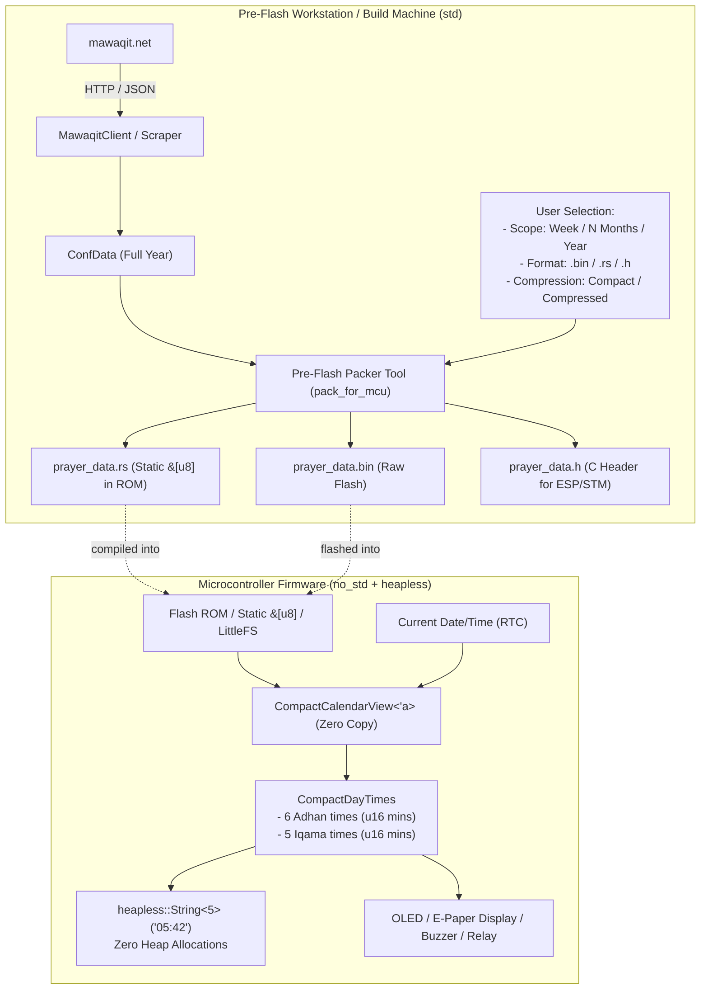

# Implementation Plan: `no_std` MCU Support with `heapless` & Pre-Flash Packaging

- **Status:** Approved
- **Date:** 2026-10-05
- **Goal:** Enable embedded microcontrollers (ESP32, RP2040, STM32, RISC-V) to run `mawaqit-api` with `#![no_std]`, while keeping `std` as the default feature in the same crate and directory.

---

## 1. Overview & Architecture

Mawaqit mosque pages embed a full 365-day prayer calendar (~15–25 KB of JSON, containing 2,000+ time strings). On microcontrollers:

1. **Networked MCUs with Heap Allocator** (e.g. ESP32, Raspberry Pi Pico W with `esp-alloc`/`embedded-alloc`):
   Can use `no_std` + `alloc` to dynamically parse mosque pages and calculate times without any OS dependencies (`tokio`, `reqwest`, `std::fs`).
2. **Constrained MCUs without Heap** (zero-alloc / `heapless`):
   Cannot or should not allocate dynamic JSON/strings. Instead, prayer data is scoped (weekly, specified months, or full year) and packed into a compact binary format (`MQTC`) before flashing.
   On the MCU, the firmware queries times using `heapless::String<5>` directly from Flash ROM with **zero heap allocations and zero RAM consumed**.



---

## 2. Compact Binary Specification (`MQTC`)

To minimize storage and eliminate RAM usage, times are converted from `"HH:MM"` strings into minutes from midnight (`0..1439`), fitting into a `u16`.

### Header Layout (12 bytes)

| Field | Type | Description |
| :--- | :--- | :--- |
| `magic` | `[u8; 4]` | `b"MQTC"` (Mawaqit Compact) |
| `version` | `u8` | Format version (currently `1`) |
| `scope_type` | `u8` | `0` = Week (7 days), `1` = Months, `2` = Full Year, `3` = Custom Range |
| `flags` | `u8` | Bit 0: imsak mode, Bit 1: has iqama, Bit 2: compressed |
| `reserved` | `u8` | `0x00` padding |
| `start_year` | `u16` (LE) | e.g. `2026` |
| `start_day_of_year` | `u16` (LE) | 1-based day of year (1..366) |
| `day_count` | `u16` (LE) | Total consecutive days packed in this blob |

### Day Record Layout (22 bytes per day)

- **Adhan times** (`[u16; 6]` = 12 bytes): `[fajr, shurouq, dhuhr, asr, maghrib, isha]` in minutes from midnight.
- **Iqama times** (`[u16; 5]` = 10 bytes): `[fajr, dhuhr, asr, maghrib, isha]` in minutes from midnight.
- Total per day: **22 bytes**.

### Payload Sizes by Scope

| Scope | Day Count | Compact Binary (`MQTC`) | Compressed (Deflate/LZ4) |
| :--- | :--- | :--- | :--- |
| **Weekly** | 7 days | **166 bytes** | ~110 bytes |
| **1 Month** | 30 days | **672 bytes** | ~380 bytes |
| **3 Months** | 90 days | **1,992 bytes** (~1.9 KB) | ~1.1 KB |
| **6 Months** | 182 days | **4,016 bytes** (~3.9 KB) | ~2.1 KB |
| **Full Year** | 365 days | **8,042 bytes** (~7.8 KB) | ~3.8 KB |

> [!TIP]
> **Zero-RAM Execution via Flash Memory-Mapping:**
> In the uncompressed 22-byte per-day format, any day's times can be looked up in $O(1)$ time via `offset = 12 + (day_index * 22)`.
> By embedding the data via `static PRAYER_DATA: &[u8] = include_bytes!("prayer_data.bin");`, the MCU reads times directly from NOR Flash with **0 bytes of RAM allocated**!

---

## 3. Pre-Flash Workflow: Choosing Scope & Exporting

A dedicated pre-flash tool (`pack_for_mcu`) lets the user select their mosque, date range, and export format on their workstation before flashing:

```bash
# 1. Full year for a mosque into a static Rust module (compiled directly into firmware)
cargo run --example pack_for_mcu -- \
  --slug grande-mosquee-de-paris \
  --scope year \
  --format rust \
  --out mcu_firmware/src/prayer_data.rs

# 2. Specified number of months (e.g. 3 months starting Ramadan / April)
cargo run --example pack_for_mcu -- \
  --slug london-central-mosque \
  --scope months --months 3 --start 2026-03-01 \
  --format bin \
  --out prayer_data.bin

# 3. Weekly rolling buffer for an ultra-compact device
cargo run --example pack_for_mcu -- \
  --slug mosquee-de-lyon \
  --scope week \
  --format c \
  --out prayer_data.h
```

Output formats supported:

- `.rs`: Rust source with `pub static PRAYER_DATA: &[u8] = &[...];`
- `.bin`: Raw binary for LittleFS / SPIFFS / EEPROM / raw flash address
- `.h`: C/C++ header (`const uint8_t PRAYER_DATA[] = { ... };`)

---

## 4. MCU Firmware Usage with `heapless`

In `no_std` firmware, the user imports `mawaqit-api` with `default-features = false, features = ["heapless"]`:

```rust
#![no_std]
use mawaqit_api::compact::{CompactCalendarView, CompactTime};
use chrono::NaiveDate;

static PRAYER_DATA: &[u8] = include_bytes!("prayer_data.bin");

fn main() {
    let calendar = CompactCalendarView::from_bytes(PRAYER_DATA)
        .expect("valid prayer data");

    let today = NaiveDate::from_ymd_opt(2026, 10, 5).unwrap();

    if let Some(times) = calendar.times_for_date(today) {
        let fajr: CompactTime = times.adhan.fajr;
        let hour = fajr.hours();                        // 5
        let minute = fajr.minutes();                    // 42
        let total_mins = fajr.minutes_from_midnight();  // 342
        let str_fajr: heapless::String<5> = fajr.to_hhmm(); // "05:42"
    }
}
```

---

## 5. Feature Architecture (Option A)

In `Cargo.toml`:

```toml
[features]
default = ["std"]

# std: desktop, servers, CLI, and packer tooling
std = [
    "alloc",
    "heapless",
    "dep:reqwest",
    "dep:tokio",
    "chrono/std",
    "serde/std",
    "serde_json/std",
    "thiserror/std",
]

# alloc: no_std with dynamic memory (ESP32, RP2040)
alloc = [
    "chrono/alloc",
    "serde/alloc",
    "serde_json/alloc",
]

# heapless: pure zero-alloc embedded firmware
heapless = [
    "dep:heapless",
]
```

---

## 6. Implementation Scope

1. **`Cargo.toml`**: Configure features, optional deps (`reqwest`, `tokio`, `heapless`), and `required-features = ["std"]` on tests.
2. **`src/lib.rs`**: Add `#![cfg_attr(not(feature = "std"), no_std)]`, expose `compact` module, conditional gates for `std` modules.
3. **`src/compact.rs`**: Implement `CompactTime`, `CompactCalendarView`, `CompactCalendarBuilder`, `to_bytes()`, `to_rust_code()`, `to_c_header()`.
4. **`src/models.rs` & `src/calendar.rs`**: Adapt collections to `alloc::collections::{BTreeMap, BTreeSet}` when `std` is disabled.
5. **`src/error.rs`**: Gate `MawaqitError::Http` under `#[cfg(feature = "std")]`, use `core::result::Result`.
6. **`src/client.rs`**: Gate `MawaqitClient` under `#[cfg(feature = "std")]`, keep pure helpers (`is_valid_slug`, `minutes_between`, `page_url`) accessible for `no_std`.
7. **`examples/pack_for_mcu.rs`**: The pre-flash tool for generating `.bin`, `.rs`, and `.h` assets.
8. **Automated Verification**:
   - `cargo test --test ut` (host regression)
   - `cargo check --target thumbv7em-none-eabihf --no-default-features --features heapless`
   - `cargo check --target riscv32imc-unknown-none-elf --no-default-features --features heapless`
   - `cargo check --target thumbv7em-none-eabihf --no-default-features --features alloc`
