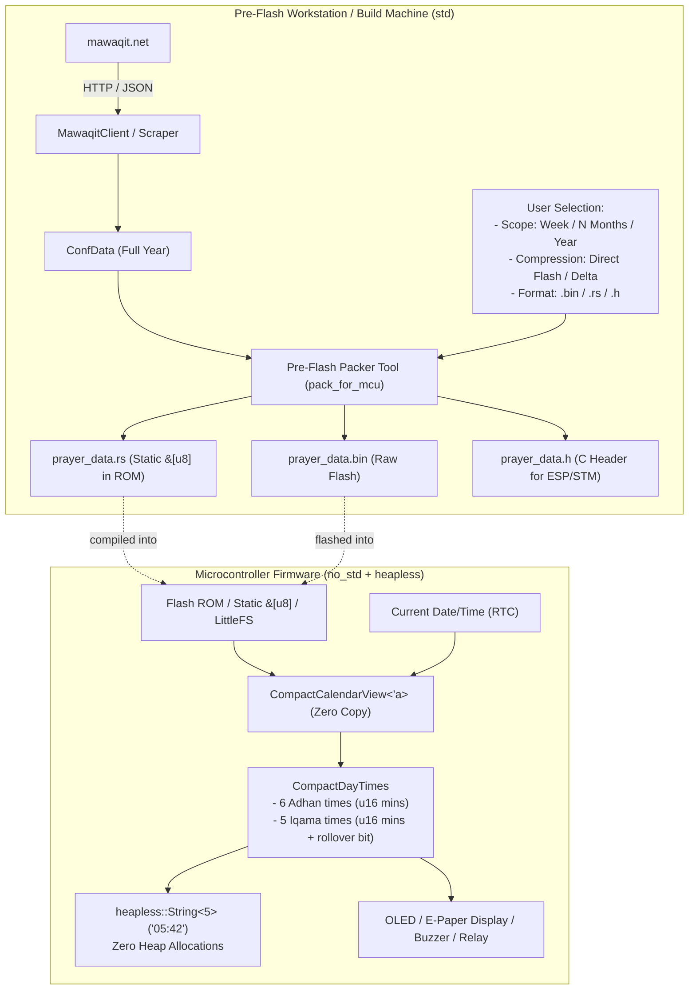

# Implementation Plan: `no_std` MCU Support with `heapless` & Pre-Flash Packaging

- **Status:** Implemented (v0.4.2) — deltas from this plan are recorded in [ADR-0014](../adr/0014-ddd-layering-and-plantuml.md): DDD layer modules (`time.rs`/`slug.rs`), serde_json made `alloc`-optional, the 12-byte delta layout replaced by the 20-byte fajr-relative layout, and the `just targets-mcu` gate added to `verify`
- **Date:** 2026-10-05
- **Goal:** Enable embedded microcontrollers (ESP32, RP2040, STM32, RISC-V) to run `mawaqit-api` with `#![no_std]`, while keeping `std` as the default feature in the same crate and directory.

---

## 1. Overview & Architecture

Mawaqit mosque pages embed a full 365-day prayer calendar (~15–25 KB of JSON, containing 2,000+ time strings). On microcontrollers:

1. **Networked MCUs with Heap Allocator** (e.g. ESP32, Raspberry Pi Pico W with `esp-alloc`/`embedded-alloc`):
   Can use `no_std` + `alloc` to dynamically parse mosque pages and calculate times without any OS dependencies (`tokio`, `reqwest`, `std::fs`).
2. **Constrained MCUs without Heap** (zero-alloc / `heapless`):
   Cannot or should not allocate dynamic JSON/strings. Instead, prayer data is scoped (weekly, specified months, or full year) and packed into a compact, 4-byte-aligned binary format (`MQTC`) before flashing.
   On the MCU, the firmware queries times using `heapless::String<5>` directly from Flash ROM with **zero heap allocations and zero RAM consumed**.



---

## 2. Hardened Compact Binary Specification (`MQTC` v1)

All records are strictly 4-byte aligned to guarantee zero HardFaults on ARM Cortex-M0/M0+.

### Header Layout (24 bytes, 4-byte aligned)

| Field | Type | Description |
| :--- | :--- | :--- |
| `magic` | `[u8; 4]` | `b"MQTC"` |
| `version` | `u8` | `0x01` |
| `scope_type` | `u8` | `0` = Week, `1` = Months, `2` = Full Year, `3` = Custom |
| `flags` | `u8` | Bit 0: imsak_mode, Bit 1: has_iqama, Bit 2: has_jumua, Bit 3: delta_compressed |
| `reserved` | `u8` | `0x00` padding |
| `start_year` | `u16` (LE) | Gregorian year (e.g. `2026`) |
| `start_day_of_year` | `u16` (LE) | 1-based day of year (1..=366) |
| `day_count` | `u16` (LE) | Total consecutive days packed in this blob |
| `jumua` | `u16` (LE) | Friday 1st prayer in minutes from midnight (`0xFFFF` if none) |
| `jumua2` | `u16` (LE) | Friday 2nd prayer in minutes from midnight (`0xFFFF` if none) |
| `pad` | `[u8; 2]` | `[0x00, 0x00]` alignment padding |
| `crc32` | `u32` (LE) | CRC-32-IEEE checksum of the header (with crc32=0) + day records |

### Day Record Layout — Direct Flash Format (24 bytes per day)

- **Adhan times** (`[u16; 6]` = 12 bytes): `[fajr, shurouq, dhuhr, asr, maghrib, isha]` in minutes from midnight (`0..1439`).
- **Iqama times** (`[u16; 5]` = 10 bytes):
  - **Bit 15 (`0x8000`)**: `ROLLOVER` bit (1 = next-day instant, solves finding C1).
  - **Bit 14 (`0x4000`)**: `VALID` bit (1 = valid iqama present).
  - **Bits 0..11 (`0x07FF`)**: Wall-clock display time in minutes (`0..1439`, strictly satisfies `HH:MM`).
- **Day flags + padding** (`[u8; 2]` = 2 bytes): `day_flags` (custom Jumu'ah override flag) + alignment padding.
- Total: **24 bytes** (100% 4-byte aligned on all architectures).

### Day Record Layout — Delta-Compressed Format (12 bytes per day)

When `--compress delta` is selected:

- `base_fajr: u16` (2 bytes)
- 5 Adhan deltas (`u8` each): `delta_shurouq`, `delta_dhuhr`, `delta_asr`, `delta_maghrib`, `delta_isha` (5 bytes)
- 5 Iqama offsets (`u8` each): relative minutes after adhan (5 bytes)
- Total: **12 bytes** (4-byte aligned). Year size: **4.4 KB** (stack decoded in registers, **0 bytes RAM**).

### Payload Sizes by Scope

| Scope | Day Count | Direct Flash (24 B/day) | Delta-Compressed (12 B/day) | RAM Required |
| :--- | :--- | :--- | :--- | :--- |
| **Weekly** | 7 days | **192 bytes** | **108 bytes** | **0 bytes** |
| **1 Month** | 30 days | **744 bytes** | **384 bytes** | **0 bytes** |
| **3 Months** | 90 days | **2,184 bytes** (~2.1 KB) | **1,104 bytes** (~1.1 KB) | **0 bytes** |
| **6 Months** | 182 days | **4,392 bytes** (~4.3 KB) | **2,208 bytes** (~2.2 KB) | **0 bytes** |
| **Full Year** | 365 days | **8,784 bytes** (~8.6 KB) | **4,404 bytes** (~4.3 KB) | **0 bytes** |

---

## 3. Pre-Flash Tool Contract (`pack_for_mcu`)

```bash
cargo run --example pack_for_mcu -- \
  --slug grande-mosquee-de-paris \
  --scope year \
  --compress none \
  --format rust \
  --out mcu_firmware/src/prayer_data.rs
```

### Year-End Boundary Handling

- When a requested scope crosses December 31st (since Mawaqit only publishes the current calendar year):
  - If `--clamp` is passed: Clamps range to Dec 31st with a clear warning.
  - If `--clamp` is not passed: Fails fast with an actionable error.

---

## 4. MCU Firmware Usage with `heapless`

```rust
#![no_std]
use mawaqit_api::compact::{CompactCalendarView, CompactTime};
use chrono::NaiveDate;

static PRAYER_DATA: &[u8] = include_bytes!("prayer_data.bin");

fn main() {
    // 1. Validates magic, buffer bounds, and CRC-32 checksum
    let calendar = CompactCalendarView::from_bytes(PRAYER_DATA)
        .expect("valid and uncorrupted prayer data");

    let today = NaiveDate::from_ymd_opt(2026, 10, 5).unwrap();

    // 2. O(1) direct lookup from Flash (0 heap, 0 RAM)
    if let Some(times) = calendar.times_for_date(today) {
        let fajr: CompactTime = times.adhan.fajr;
        let str_fajr: heapless::String<5> = fajr.to_hhmm(); // "05:42"

        // Iqama with rollover inspection
        if let Some(iqama) = times.iqama {
            let isha_iqama: CompactTime = iqama.isha;
            let rollover = isha_iqama.is_rollover(); // true if past midnight
        }
    }
}
```

---

## 5. Feature Architecture (Option A)

```toml
[features]
default = ["std"]

# std: desktop, servers, CLI, and packer tooling
std = [
    "alloc",
    "heapless",
    "dep:reqwest",
    "dep:tokio",
    "chrono/std",
    "serde/std",
    "serde_json/std",
    "thiserror/std",
]

# alloc: no_std with dynamic memory (ESP32, RP2040)
alloc = [
    "chrono/alloc",
    "serde/alloc",
    "serde_json/alloc",
]

# heapless: pure zero-alloc embedded firmware
heapless = [
    "dep:heapless",
]
```

---

## 6. Implementation Scope

1. **`Cargo.toml`**: Configure features, optional deps (`reqwest`, `tokio`, `heapless`), and `required-features = ["std"]` on tests.
2. **`src/lib.rs`**: Add `#![cfg_attr(not(feature = "std"), no_std)]`, expose `compact` module, conditional gates for `std` modules.
3. **`src/compact.rs`**: Implement `CompactTime` (with rollover/validity bits), `CompactCalendarView` (with CRC-32 and Jumu'ah), `CompactCalendarBuilder`, `to_bytes(compress: bool)`, `to_rust_code()`, `to_c_header()`.
4. **`src/models.rs` & `src/calendar.rs`**: Adapt collections to `alloc::collections::{BTreeMap, BTreeSet}` when `std` is disabled.
5. **`src/error.rs`**: Gate `MawaqitError::Http` under `#[cfg(feature = "std")]`, add `Compact(CompactError)` with CRC mismatch variant, use `core::result::Result`.
6. **`src/client.rs`**: Gate `MawaqitClient` under `#[cfg(feature = "std")]`, keep pure helpers (`is_valid_slug`, `minutes_between`, `page_url`) accessible for `no_std`.
7. **`examples/pack_for_mcu.rs`**: The pre-flash tool for generating `.bin`, `.rs`, and `.h` assets with `--clamp` and `--compress` options.
8. **Automated Verification**:
   - `cargo test --test ut` (host regression)
   - `cargo check --target thumbv7em-none-eabihf --no-default-features --features heapless`
   - `cargo check --target riscv32imc-unknown-none-elf --no-default-features --features heapless`
   - `cargo check --target thumbv7em-none-eabihf --no-default-features --features alloc`
