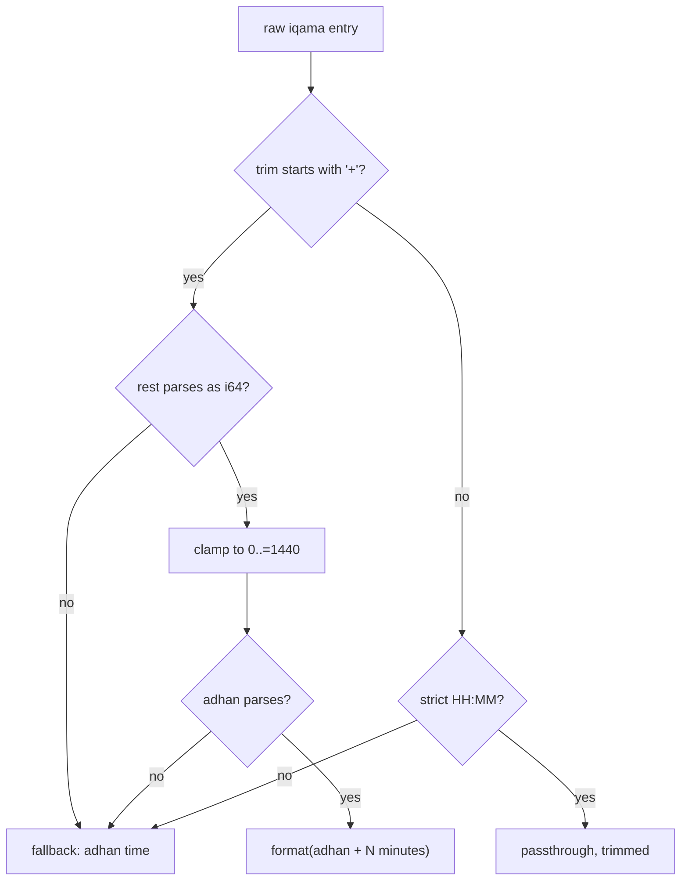

# Spec: Calendar resolution

Normative description of `src/calendar.rs`: how raw calendar rows become
typed, validated times. Pure functions over `ConfData` — no I/O, no clock
(`today()` injects `Local::now()` in the client).

## Row layouts (`RawCalendar`)

`calendar` is 12 months (index 0 = January); a month maps day-strings to
rows of `HH:MM`-ish strings. Three row shapes exist in the wild:

### Row layout 1 — normal, with shuruq column (6 values)
`[Fajr, Shuruq, Dhuhr, Asr, Maghrib, Isha]`
Detected when `row.len() >= 6 && row[1]` parses as a time.
→ `DailyPrayerTimes { fajr: row[0], shurouq: row[1], dhuhr: row[2], … }`.

### Row layout 2 — imsak ("Sabah İmsak", Diyanet/DİTİB), with shuruq column (7 values)
`[İmsak, Sabah, Shurûq, Dhuhr, Asr, Maghrib, Isha]`
Same detection (≥ 6 values, `row[1]` parses); after removing the shuruq
column at index 1, **6 prayers remain** ⇒ imsak mapping:
`fajr = İmsak (row[0])`, `shurouq = Diyanet Güneş (row[2])`, then the rest.
`row[1]` ("Sabah") is an extra chip value, never surfaced as a prayer time.

### Row layout 3 — plain prayer list, no shuruq column (5 or 6 values)
Detected when the row is < 6 values **or** `row[1]` does not parse as a
time.
- 6 values: positional `fajr, shurouq, dhuhr, asr, maghrib, isha`.
- 5 values: `shurouq` comes from the page-level `shuruq` field; missing
  there ⇒ `Parse("no shuruq value for day")`.

Anything else (0–4 values, > 7, or 6/7-with-column after removal ≠ 5/6) ⇒
`Parse("expected 5 or 6 prayer times, got N")`.

### Layout confusion matrix
`times.len()` (5/6/7 — imsak inference) and row shape are **independent
signals**; every combination must survive the pipeline without panicking
(pinned by `ut/semantics.rs::layout_confusion_matrix_never_panics`).

## Imsak mode inference

`imsak_mode = (times.len() == 6)` — decided **once, at the scraper, by the
daily-times count alone**. The calendar row shape is never consulted (it is
ambiguous: a 6-value row could be layout 1 or a degraded layout 2). Pinned
by `ut/semantics.rs::imsak_mode_is_decided_by_times_count_alone`; the
flag travels in `ConfData::imsak_mode` for display layers.

## Display contract

> A surfaced time is **exactly** `HH:MM`: 5 bytes, `:` at index 2, both
> halves all digits, hours < 24, minutes < 60.

`is_displayable_hhmm` is the single predicate (test-side twin:
`valid_hhmm` in `tst/common`). Enforcement:

- `daily_from_row` validates **all six** surfaced fields; one bad value
  rejects the whole row (F4). `month_times` drops rejected days
  **silently** (the month view just has fewer days); `times_for_date`
  returns `Err` if *today* is such a day.
- Iqama passthrough goes through the same predicate — a non-displayable
  absolute value is treated as garbage (below).

## Iqama resolution (`resolve_iqama`)

For each raw iqama string, resolved against its adhan time:

Rules and their rationale:

- `"+600"` at adhan `23:30` ⇒ `"09:30"` — next-day wall clock is inherent
  to `HH:MM` display; rollover is valid (pinned:
  `ut/semantics.rs::iqama_offset_rollover_stays_valid_hhmm`).
- Clamp `[0, 1440]`: real offsets are minutes; huge hostile values
  (`i64::MAX`) must not panic or wrap (regression:
  `TimeDelta::minutes(i64::MAX)` used to panic —
  `calendar.rs::hostile_iqama_offsets_do_not_panic`).
- `"+abc"`, `"+"`, `"++5"` edge behavior: one `+` is stripped, so `"+5"`
  parses inside `"++5"` ⇒ +5 minutes; unparseable ⇒ adhan fallback.
- Non-`+` garbage and non-displayable absolutes ⇒ adhan fallback (the
  official integrations' behavior).
- A day needs ≥ 5 iqama values; fewer ⇒ `Parse` ⇒ the day drops from
  `month_iqama_times`.

## Day keys

- Keys are wire strings; `key.parse::<u32>()` must succeed and the day is
  used as-is. Exotic keys (`"١"`, `"1e2"`, `"4294967296"`, `" 1"`,
  `"1.0"`, `"0x1"`, `"٣"`) are **skipped**, never coerced, never counted
  (pinned: `ut/semantics.rs::exotic_month_keys_are_skipped`).
- **Duplicate keys are deduplicated** (finding F5, fixed): `"1"`, `"01"`,
  `"+1"` all parse to day 1, so `month_times`/`month_iqama_times` keep one
  entry per day — the **canonical decimal key** (`"1"`) always wins over
  its variants; among variants alone (no canonical key present), BTreeMap
  order decides deterministically. Regression-pinned:
  `ut/semantics.rs::finding_f5_duplicate_day_keys_yield_one_day`.

## Month / date extraction

- `month_times(conf, month)`: month ∈ 1..=12 else `InvalidMonth`; missing
  month bucket ⇒ `NoCalendar`; rows failing `daily_from_row` are dropped;
  output sorted by day.
- `month_iqama_times(conf, month)`: needs `iqama_calendar` (else
  `NoCalendar`) *and* the adhan month (to expand `+N`); days whose adhan
  row is missing/rejected are skipped.
- `times_for_date(conf, date)`: adhan from the month bucket, iqama
  best-effort — if *any* iqama piece fails, iqama is `None` while adhan
  still surfaces (degradation, not failure). Missing adhan day ⇒ `NoCalendar`.

## Contract summary table

| Input condition | Observable behavior |
| --- | --- |
| Row surfacing `"25:70"` anywhere | day rejected everywhere (`times_for_date` ⇒ `Err`; dropped from month view) |
| Row of 3 values | day dropped (month view) / `Err` (today) |
| All rows broken | `month_times` ⇒ empty `days`; `times_for_date` ⇒ `NoCalendar` |
| `iqamaCalendar` with one `null` | iqama = `None` everywhere; adhan unaffected |
| iqama `"+9223372036854775807"` | resolved as +1440 (clamped) — next-day wall clock, valid `HH:MM` |
| iqama `"7:5"` | adhan fallback |
| month `0` or `13` | `InvalidMonth(u32)` |

## Timezone contract for `iqama_at` (F28 / ADR-0015)

`iqama_at` instants are **mosque-local wall clock** with the C1 rollover
already applied. The only sanctioned zone source is
`ConfData::timezone()` — the page's `timezone` field, shape-validated
(non-empty, ≤ 64 bytes, `[A-Za-z0-9_./+-]`, no absolute path, no `..`
segment); a hostile or absent value is `None`, never a guess. Consumers
convert wall clock + zone to an absolute instant with chrono's
`LocalResult`: raise rather than guess in the spring-forward gap, take
the *earlier* offset on the ambiguous autumn hour (a late alarm is less
harmful than one that lies about having passed). The library never picks
an offset itself — see
[ADR-0015](../adr/0015-timezone-and-iqama-instants.md).
