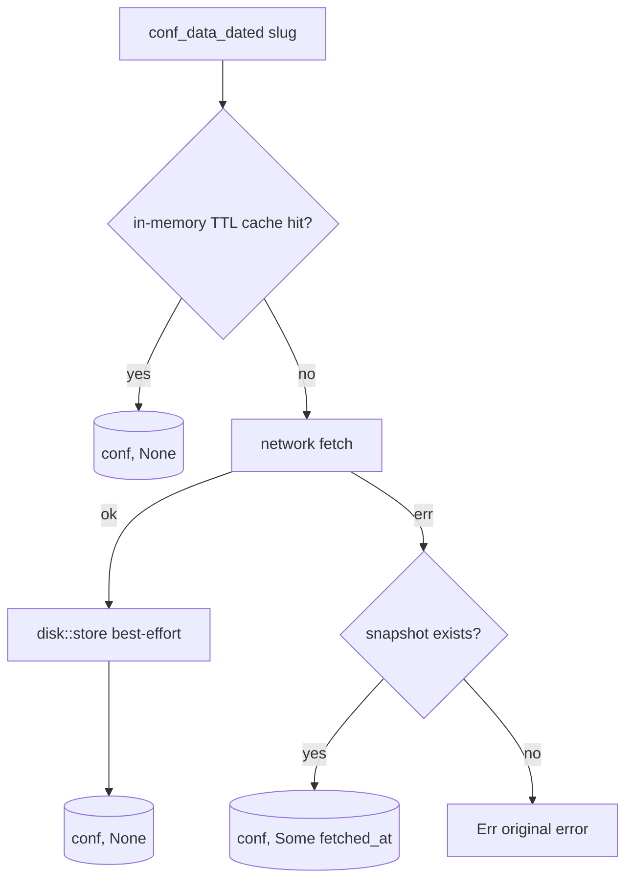

# Spec: Offline snapshots

Normative description of `src/disk.rs` — the opt-in offline layer. Enabled
per client with `MawaqitClient::with_disk_cache(dir: PathBuf)`.

## Threat model (drives every rule below)

The snapshot directory is **attacker-writable at the same privilege as the
app config** (same user). Therefore:

1. `load` must be **total**: missing, truncated, stale-schema or hostile
   files yield `None` — never a panic, never partial data.
2. A hostile **slug** must never control a path (no traversal, no forgery).
3. A snapshot must **never serve a different mosque**.

## File layout

| Property | Value |
| --- | --- |
| Filename | `format!("{:016x}.json", DefaultHasher(slug))` inside `dir` — slug never appears in the path |
| Envelope version | `SNAPSHOT_VERSION = 1`; mismatch ⇒ file ignored |
| Scratch file | `path.json.tmp`, removed by the atomic rename on success |

## Envelope (v1)

```json
{
  "version": 1,
  "mosque_slug": "grande-mosquee-de-paris",
  "fetched_at": "2026-10-05",
  "conf": { "…ConfData serialization…": "…" }
}
```

- `mosque_slug` is verified against the requested slug on load — a file can
  never be served for a different mosque (regression-pinned:
  `src/disk.rs::snapshot_never_serves_a_different_mosque`).
- `fetched_at` is the local date the snapshot was stored; surfaced through
  `conf_data_dated` as the "served from disk, as of" date.
- No TTL: staleness is *reported*, never silently enforced.

## Storage value construction (`conf_to_storage`)

The `conf` value is **the typed struct's serialization, overlaid with
unmodeled raw extras** — not the raw wire object, not the bare struct:

1. Clone `ConfData`, set `raw = Null` (a flattened struct serialized with a
   populated `raw` would duplicate `times`/`calendar`/`name` keys and the
   file could never parse back — the F10 regression).
2. `serde_json::to_value` the stripped struct.
3. For every key in the original `raw` object: `or_insert` into the result.
   **Modeled keys always win**; only keys the model does not know are
   copied.

Why: the live path tolerates shapes strict serde rejects (nulls inside
iqama rows, numeric names — [ADR-0003](../adr/0003-tolerant-wire-parsing.md)
F10). Storing raw verbatim would write those shapes back and the snapshot
could never load — offline mode silently dead for exactly the messy
real-world mosques. Storing only the struct would lose unmodeled fields.
Pinned by `src/disk.rs::messy_wire_shapes_in_raw_never_break_loading`,
`roundtrip_survives_a_populated_raw_object`, and
`tst/fuzz/mutation.rs::finding_f10_snapshot_roundtrips_wire_tolerated_shapes`.

## `store(dir, slug, conf) -> Option<NaiveDate>`

1. Build the envelope (`fetched_at = Local::now().date_naive()`).
2. Serialize **fully in memory**; serialization failure ⇒ `None` (nothing
   written).
3. `create_dir_all(parent)` ⇒ best-effort.
4. Write `…json.tmp`, then `std::fs::rename` onto `…json`.
5. Any I/O failure ⇒ `None`; the previous snapshot is untouched.

**Best-effort contract at the client level** (`conf_data_dated`): a failed
store never breaks an online fetch. A successful store leaves *exactly one*
file (no `.tmp` residue — pinned by
`atomic_write_leaves_no_tmp_behind`).

## `load(dir, slug) -> Option<(NaiveDate, ConfData)>`

Total-function contract; every row yields `None`:

| File state | Result |
| --- | --- |
| Missing / unreadable | `None` |
| Empty, not JSON, wrong top-level type | `None` |
| Truncated envelope (missing keys) | `None` |
| `fetched_at` not a `NaiveDate` | `None` |
| `version != 1` | `None` |
| `mosque_slug != slug` | `None` |
| `conf` fails tolerant `ConfData` deserialization | `None` |

Success ⇒ `(fetched_at, conf)` where `conf` is guaranteed digestible by
the calendar pipeline (fuzz-pinned: every mutation that loads is pushed
through `dig()`).

## Client integration (decision flow)



## Slug → filename hardening (fuzz-pinned)

For slugs `../../etc/passwd`, `..\..\windows\win.ini`, `a/b/c`, `""`,
`"\0‮"`, 100 000 × `"x"`, `🕌` × 100, and 400 random mutations each:
`snapshot_path(dir, slug).parent() == Some(dir)` and extension `json` —
always (tests: `hostile_slugs_stay_inside_the_directory`,
`tst/fuzz/mutation.rs::fuzz_disk_store_load_roundtrip_under_hostile_slugs`).

## Public API

`mawaqit_api::disk::{store, load, snapshot_path}` is public so tooling and
examples (`offline_mirror.rs`, `conf_diff.rs`) can warm and inspect
snapshots without a client instance.
